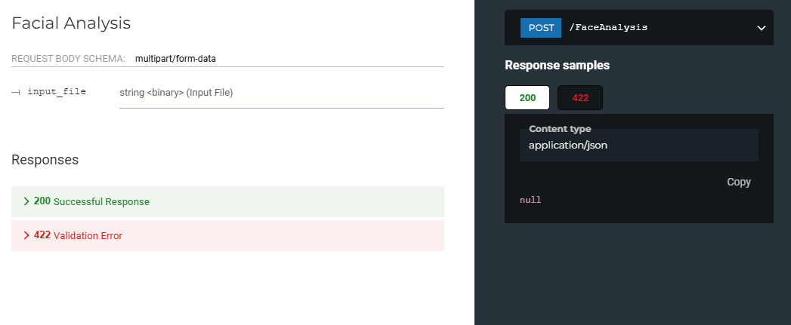

# Face Analysis API

This project provides an API endpoint for analyzing facial attributes such as age, gender, race, and emotion. The analysis is performed using the DeepFace library, and the results are annotated on the image.


## Features

- Analyze facial attributes (age, gender, race, emotion) using DeepFace.
- Annotate the analyzed attributes on the image.
- Save the processed image to a file.
- Return the processed image as a JPEG stream.


## Installation

1. Clone the repository:

   ```bash
   git clone https://github.com/nakhani/FastAPI/tree/bf01708126d6839ca0b80d1c4af81f8fa2c702c9/FastAPI/Image-based%20API

    cd Image-based API
   ```
1. Install the required dependencies:

   ```bash
   pip install -r requirements.txt
    ```
## Usage

1. Run the FastAPI server:

   ```bash
    uvicorn main:app --reload
    ```

2. Send a POST request to the **/FaceAnalysis** endpoint with an image file. You can use a tool like **curl** or Postman.


   ```bash
    curl -X POST "http://127.0.0.1:8000/FaceAnalysis" -H "accept: image/jpeg" -H "Content-Type: multipart/form-data" -F "input_file=@path_to_your_image.jpg" --output processed_image.jpg
   ```

   


3. The processed image with annotated attributes will be saved as processed_image.jpg in the current working directory.