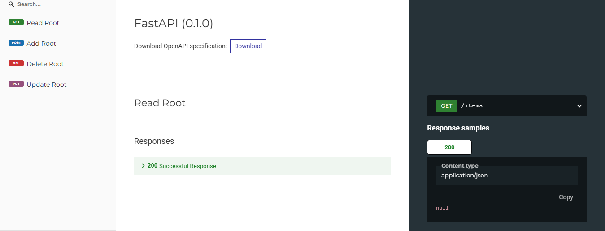
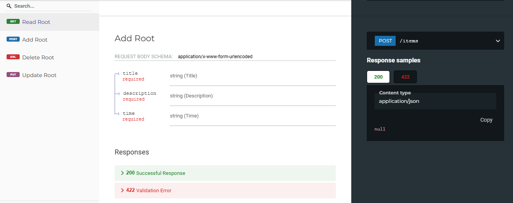
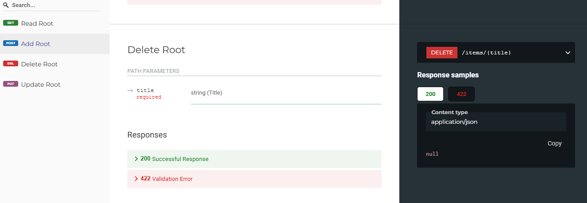
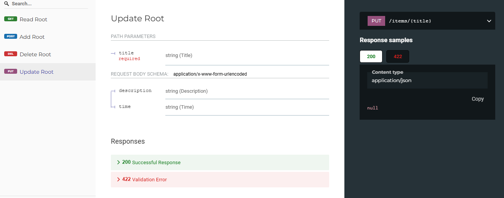

# To-Do APP

A simple To-Do application built with FastAPI and SQLite.

## Features

- Add new tasks
- Get a list of all tasks
- Update task details
- Delete tasks

## Endpoints

### GET /items
Fetch all tasks.



**Response:**
```json
[
  {
    "title": "Party",
    "description": "Dance with my love",
    "time": "April 16, 2024",
    "status": 0
  },
  ...
]
```

### POST /items
Add a new task.



**Request:**

- title: str (Form)

- description: str (Form)

- time: str (Form)

**Response:**

Updated list of tasks.

### DELETE /items/{title}
Delete a task by its title.



**Response:**
```json
[
 { "message": "Item deleted" }
]
```

### PUT /items/{title}
Update a task by its title.



**Request:**

- new_description: str (Form) [optional]

- new_time: str (Form) [optional]

**Response:**

Updated task details.

## Installation

1. Clone the repository:
 
    ```bash
    git clone https://github.com/nakhani/FastAPI/tree/1a79a476adda102c2f28d1b6f2660418c561916e/FastAPI/To-Do%20App
    ```
2. Install dependencies:

   ```bash
    pip install -r requirements.txt
    ```

3. Run the API:

    ```bash
    uvicorn main:app --reload
    ```

## Usage

You can use tools like Postman or cURL to interact with the API endpoints.
