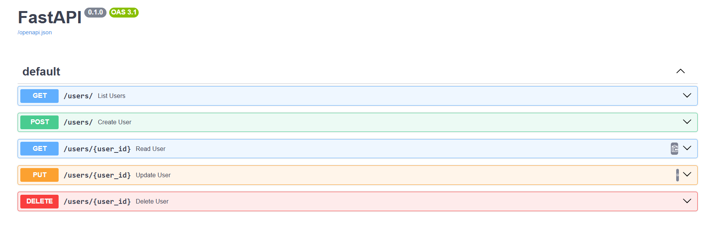
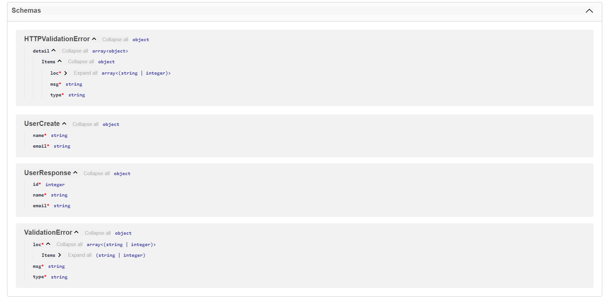

# 🚀 Beginner FastAPI App with SQLite & SQLAlchemy

This project is a basic user management API built with **FastAPI**, **SQLAlchemy**, and **SQLite**, designed as a **foundational API development**.

---

## 📁 Project Structure

 ```bash
📦 beginner_app
 ┣ 📄 main.py            → Main FastAPI application file
 ┣ 📄 beginner_app.db    → SQLite database file
 ┣ 📄 .gitignore         → Specifies files to ignore in version control
 ┣ 📄 requirements.txt   → List of required Python packages
 ┗ 📄 README.md          → Project documentation file
```

---

## 🔧 Features

- SQLite database connected via SQLAlchemy
- `User` model with fields: `id`, `name`, `email`
- Supports RESTful API endpoints: `GET`, `POST`, `PUT`, `DELETE`
- Swagger & Redoc auto-generated documentation
- Error handling for duplicates and missing records

---

## ▶️ How to Run

First, install the required dependencies:

```bash
pip install -r requirements.txt
```

Then, launch the FastAPI development server:

```bash
uvicorn main:app --reload
```

The server will run locally at:

```bash
http://127.0.0.1:8000
```
---
## 📜 API Documentation (Swagger UI)

FastAPI automatically generates a Swagger interface to test and interact with your API.

Open in browser:

```bash
http://127.0.0.1:8000/docs
```
🔽 Example Swagger UI screenshot:




---

## 🧪 Technologies Used

- FastAPI
- Uvicorn
- SQLAlchemy
- SQLite
- Pydantic
- Python 3.9+


