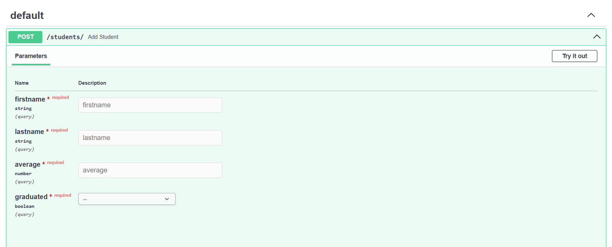
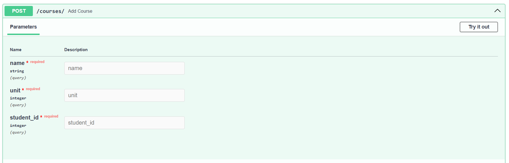
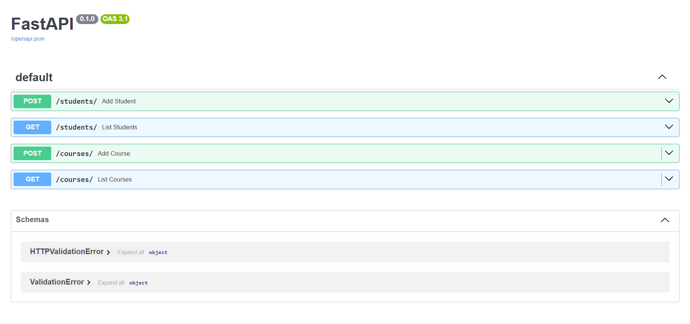

# 📘 University Management API

This project is a **FastAPI-based RESTful service** for managing students and courses. It leverages **Docker** for environment consistency and uses **PostgreSQL** as the backend database. Designed with modern architecture principles, it supports scalable, secure, and testable API endpoints.

---
## 📂 API Endpoints Overview

### 🔹Students
- `GET /students` – Get list of all students
- `POST /students` – Add a new student
- `GET /students/{id}` – Get details of a specific student
- `PUT /students/{id}` – Update student info
- `DELETE /students/{id}` – Remove a student

### 🔹Courses
- `GET /courses` – Get list of all courses
- `POST /courses` – Add a new course
- `GET /courses/{id}` – Get details of a specific course
- `PUT /courses/{id}` – Update course info
- `DELETE /courses/{id}` – Remove a course

---

## 🧪 Testing the API

- Open Swagger docs: [Here](http://localhost:8000/docs)
- Try out endpoints interactively using the built-in Swagger interface

### 🟦 Students – POST Endpoint


### 🟥 Courses – POST Endpoint


### 🔧 Swagger UI Interface


---

## ▶️ How to Run

First, install the required dependencies:

```bash
pip install -r requirements.txt
```

Then, Create a `.env` file in the root directory with the following variables:

```bash
DATABASE_URL=postgresql://user:password@db:5432/university_db
```

Run with Docker Compose:

```bash
docker-compose up --build
```
The server will run locally at:

```bash
http://127.0.0.1:8000
```

---
## 📤 Deployment

This API is deployed on [Liara](https://liara.ir/) — a modern cloud platform supporting Docker-based applications. By using **Liara**, the project benefits from simple configuration, automatic HTTPS, and built-in support for PostgreSQL and scalable container hosting.

## 🧪 Technologies Used

- FastAPI
- Uvicorn
- SQLAlchemy
- PostgreSQL
- Pydantic
- Python 3.9+
- Docker
- Swagger UI 
