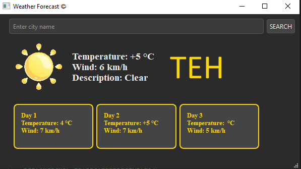

# 1.1 Introduction to API

APIs (Application Programming Interfaces) are powerful tools that enable different software applications to communicate with each other. By providing a set of rules and protocols, APIs allow developers to access specific functionalities or data from other applications, enhancing the versatility and capabilities of their own software. This repository contains two assignments that demonstrate the use of APIs in practical applications.

## Assignment 1: GUI-based Weather App ☀️⛅️🌧️🌦️🌩️🌨️

### Objective
Create a graphical user interface (GUI) weather application that allows users to search for and display weather information for a specified city.

### Features
- **City Search**: Use an input box to enter and select a city.
- **Weather Data Retrieval**: Utilize the GoWeather API to fetch and display weather information for the specified city. The API endpoint is:
  [GoWeather API](https://goweather.herokuapp.com/weather/Mashhad)
- **Error Handling**: Implement error handling to manage cases where the API may not function correctly.
- **Frameworks and Tools**: Develop the application using PySide6, Qt, and Python 3.

   


## Assignment 2: Using Different Programming Languages to Utilize APIs

### Objective
Write code to interact with different APIs using a programming language of your choice. This assignment demonstrates the versatility of APIs and how they can be used across different languages.

### Features
- **API Interactions**: Write code to interact with four different APIs. The chosen APIs for this assignment are:
  1. **Fruit API** 🍉
  2. **Number API** 🔢
  3. **Weather API** ⚡️
  4. **Quran API** 📖
  5. **Notexitedperson API** 👩
  6. **Photo API** 🖼
  7. **Dictionary API** 📕

### Implementation
- Write Go language scripts to interact with each API.

## How to Run the Code
1. Clone the repository:
   ```sh
   git clone https://github.com/nakhani/FastAPI/tree/90b2d57312628944f03c3d9d286b5f7a3a6645f9/Introduction_to_API
   ```

2. Navigate to the directory:
   ```sh
   cd Introduction_to_API
   ```

3. Install the required packages:
   ```sh
   pip install -r requirements.txt
   ```

4. Run the Weather App:
   ```sh
   python weather.py  
   ```
5. Run the Go Files:
   ```sh
   go run fruit.go #For giving fruit's information
   go run number.go #For giving number's information
   go run person.go #For generating not exited person's photo
   go run quran.go #For giving Surah's information
   go run weather.go #For giving city's weather information
   go run photo.go #For generating a photo
   go run dictionary.go #For giving word's information
   ```

## Technologies Used
- Python 3
- PySide6
- Go

